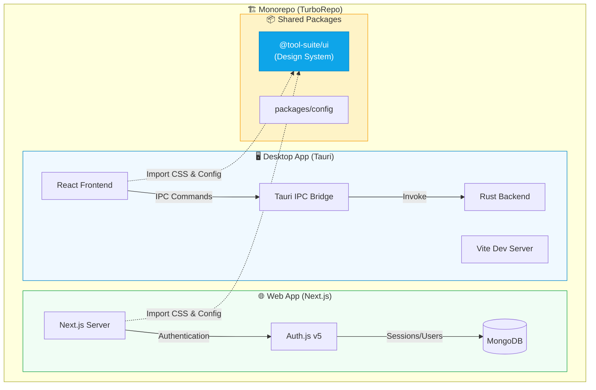
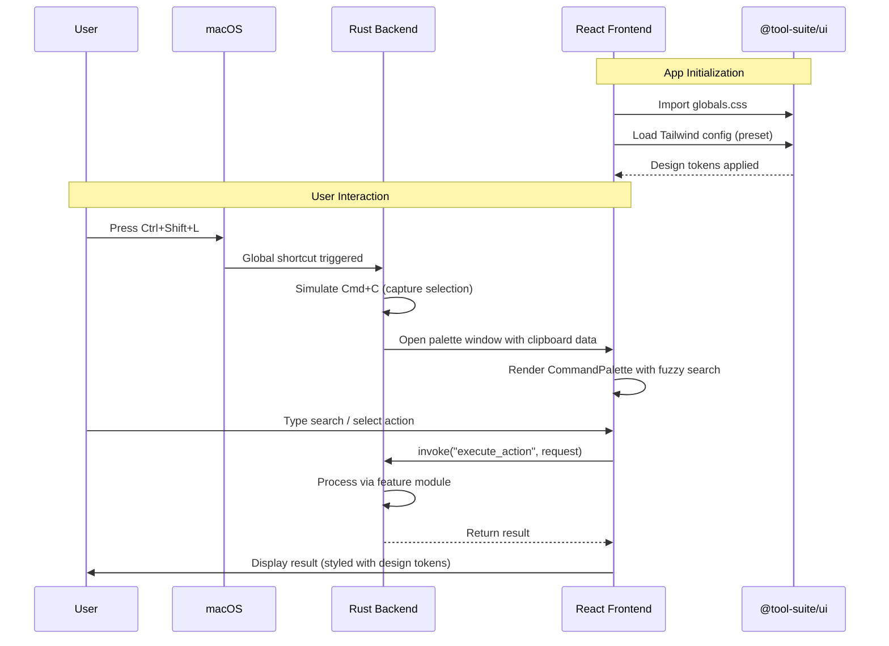
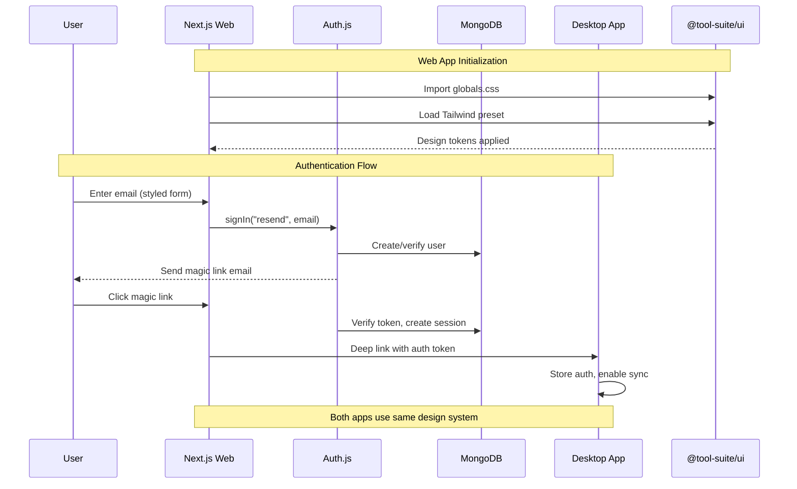

# Productivity Widgets - Complete Architecture Documentation

## Overview

**Productivity Widgets** is a macOS-only desktop productivity application built as a **TurboRepo Monorepo**. It provides quick-access utilities (translator, currency converter, unit converter, etc.) via a global hotkey-triggered Command Palette, running from the macOS menu bar.

---

## Technology Stack

| Layer              | Technology                                      |
| ------------------ | ----------------------------------------------- |
| **Monorepo**       | TurboRepo + npm workspaces                      |
| **Desktop App**    | Tauri 2.x (Rust backend + React frontend)       |
| **Web App**        | Next.js 14 (App Router)                         |
| **Frontend**       | React 18, TypeScript, Tailwind CSS, Radix UI    |
| **Design System**  | Shared Tailwind config + globals.css in `@tool-suite/ui` |
| **State**          | Zustand                                         |
| **Search**         | Fuse.js (fuzzy matching)                        |
| **Backend**        | Rust (async-std, Tauri IPC)                     |
| **Auth**           | Auth.js v5 (Magic Link via Resend)              |
| **Database**       | MongoDB + Mongoose (for web app)                |
| **System**         | macOS Private APIs (tray, global shortcuts)     |

---

## High-Level Architecture



---

## Folder Structure

```
tool-suite-antigravity/
├── apps/
│   ├── desktop/              # Tauri Desktop Application
│   └── web/                  # Next.js Web Application
├── packages/
│   ├── ui/                   # Shared Design System (@tool-suite/ui)
│   │   ├── src/
│   │   │   └── globals.css   # Shared global styles, fonts, design tokens
│   │   ├── tailwind.config.ts # Shared Tailwind configuration
│   │   └── package.json      # Package exports
│   └── config/               # Shared configurations (placeholder)
├── turbo.json                # TurboRepo task configuration
└── package.json              # Root workspace configuration
```

---

## Desktop Application (`apps/desktop/`)

### Structure
```
apps/desktop/
├── src/                      # React Frontend
│   ├── App.tsx               # Root component, widget router
│   ├── api.ts                # Legacy Tauri IPC wrapper
│   ├── main.tsx              # React entry point
│   ├── index.css             # Global styles
│   ├── components/           # UI Components
│   │   ├── CommandPalette.tsx      # Main command interface
│   │   ├── ui/                     # Radix UI primitives
│   │   └── widgets/                # Feature widgets
│   ├── logic/                # Business logic layer
│   │   ├── api/              # Tauri IPC calls
│   │   ├── hooks/            # React hooks
│   │   ├── state/            # Zustand store
│   │   ├── types/            # TypeScript interfaces
│   │   └── utils/            # Utility functions
│   └── types.ts              # Shared type definitions
├── src-tauri/                # Rust Backend
│   ├── src/
│   │   ├── lib.rs            # Main Tauri setup, IPC handlers
│   │   ├── main.rs           # Entry point
│   │   ├── config.rs         # Window configurations
│   │   ├── core/             # Core functionality
│   │   │   ├── clipboard/    # Clipboard monitoring
│   │   │   ├── context/      # Usage ranking
│   │   │   ├── features/     # Widget backends
│   │   │   └── security/     # Security utilities
│   │   ├── system/           # macOS integrations
│   │   │   ├── automation/   # Cmd+C simulation
│   │   │   └── window/       # NSWindow management
│   │   └── shared/           # Shared utilities
│   └── tauri.conf.json       # Tauri configuration
├── package.json              # Frontend dependencies
└── vite.config.ts            # Vite bundler config
```

### Key Files & Their Roles

#### Frontend (`src/`)

| File/Directory | Role |
|----------------|------|
| [App.tsx](file:///Users/lilitgrigorian/Desktop/tool-suite-antigravity/apps/desktop/src/App.tsx) | Root component; routes between widgets based on URL params |
| [CommandPalette.tsx](file:///Users/lilitgrigorian/Desktop/tool-suite-antigravity/apps/desktop/src/components/CommandPalette.tsx) | Main UI: fuzzy search, keyboard nav, action execution |
| `components/ui/` | Radix-based primitives: Button, Dialog, Select, Combobox, etc. |
| `components/widgets/` | 7 feature widgets (Translator, Currency, Unit, Time, Definition, Text Analyser, Settings) |
| `logic/api/tauri.ts` | Type-safe Tauri `invoke()` wrapper |
| `logic/state/store.ts` | Zustand store for global state (widget type, settings, clipboard) |
| `logic/hooks/` | Custom hooks (deep link listeners, auth) |

#### Backend (`src-tauri/src/`)

| File/Directory | Role |
|----------------|------|
| [lib.rs](file:///Users/lilitgrigorian/Desktop/tool-suite-antigravity/apps/desktop/src-tauri/src/lib.rs) | Main Tauri setup: window creation, tray menu, global shortcuts, IPC command handlers |
| `main.rs` | Entry point, calls `run()` from lib.rs |
| `config.rs` | Window dimension/position configurations |
| `core/clipboard/` | Background clipboard monitoring, history management |
| `core/features/` | Backend logic for each widget (translator, currency, unit_converter, time_converter, definition, text_analyser) |
| `core/context/` | Usage tracking for smart command ranking |
| `system/automation/` | macOS Accessibility API (simulates Cmd+C) |
| `system/window/` | NSWindow/NSPanel management for floating windows |

### Data Flow (Desktop)



---

## Web Application (`apps/web/`)

### Structure
```
apps/web/
├── app/                      # Next.js App Router
│   ├── api/                  # API routes
│   │   └── auth/[...nextauth]/   # Auth.js route handler
│   ├── dashboard/            # Protected dashboard
│   ├── login/                # Login page
│   ├── signup/               # Signup page
│   ├── onboarding/           # User onboarding flow
│   ├── layout.tsx            # Root layout
│   └── page.tsx              # Landing page
├── components/               # React components
│   └── auth/                 # Auth-related UI
├── lib/                      # Utilities
│   ├── actions/              # Server actions
│   └── db/                   # Database layer
│       ├── connect.ts        # Mongoose connection
│       ├── models.ts         # Mongoose schemas
│       ├── queries.ts        # DB query functions
│       └── adapter-client.ts # Native MongoClient for Auth.js
├── auth.ts                   # Auth.js configuration
├── auth.config.ts            # Auth providers config
└── middleware.ts             # Route protection
```

### Key Files & Their Roles

| File | Role |
|------|------|
| [auth.ts](file:///Users/lilitgrigorian/Desktop/tool-suite-antigravity/apps/web/auth.ts) | Auth.js setup with MongoDBAdapter, JWT sessions |
| `lib/db/models.ts` | Mongoose schemas (User, Device, Session, OTP) |
| `lib/db/connect.ts` | Mongoose connection singleton |
| `lib/actions/` | Server actions for auth, onboarding |
| `middleware.ts` | Route protection for authenticated pages |

### Auth Flow



---

## IPC Communication (Desktop)

The frontend communicates with the Rust backend via Tauri's `invoke()` function:

| Command | Description |
|---------|-------------|
| `get_settings` | Retrieve app settings |
| `save_settings` | Persist settings to disk |
| `capture_selection` | Simulate Cmd+C, get clipboard |
| `translate_text` | Translate via configured API |
| `convert_currency` | Currency conversion |
| `execute_action` | Run inline actions (unit, time, definition, text analysis) |
| `hide_palette_window` | Close palette on blur |
| `get_command_items` | Get available commands for palette |

---

## State Management

### Desktop (Zustand)

```typescript
// store.ts
interface AppState {
  currentWidget: WidgetType;
  settings: AppSettings | null;
  clipboardHistory: ClipboardEntry[];
  // ... actions
}
```

Widgets managed: `palette`, `translator`, `currency`, `unit_converter`, `time_converter`, `definition`, `text_analyser`, `settings`

---

## Feature Modules (Rust Backend)

Each feature is a self-contained module in `core/features/`:

| Module | File | Functionality |
|--------|------|---------------|
| **Translator** | `translator.rs` | Multi-language translation (API-based) |
| **Currency** | `currency.rs` | Live exchange rates, fuzzy currency matching |
| **Unit Converter** | `unit_converter.rs` | Comprehensive unit conversion (length, weight, volume, etc.) |
| **Time Converter** | `time_converter.rs` | Timezone conversions |
| **Definition** | `definition.rs` | Word definitions (dictionary API) |
| **Text Analyser** | `text_analyser.rs` | Word count, character analysis |

---

## UI Component Library

Based on **Radix UI** primitives, styled with **Tailwind CSS**:

| Component | File | Usage |
|-----------|------|-------|
| Button | `ui/button.tsx` | Primary actions |
| Dialog | `ui/dialog.tsx` | Modal windows |
| Select | `ui/select.tsx` | Dropdowns |
| Combobox | `ui/combobox.tsx` | Searchable selects |
| Command | `ui/command.tsx` | cmdk-based command menu |
| Popover | `ui/popover.tsx` | Floating content |
| Tabs | `ui/tabs.tsx` | Tabbed interfaces |

---

## Shared Design System (`packages/ui/`)

### Overview

The `@tool-suite/ui` package serves as the **Single Source of Truth** for design tokens across both desktop and web applications. This ensures visual consistency throughout the monorepo.

### Structure

```
packages/ui/
├── src/
│   ├── globals.css           # Shared global styles
│   └── index.tsx             # Component exports (placeholder)
├── tailwind.config.ts        # Shared Tailwind configuration
└── package.json              # Package configuration
```

### Design Tokens

#### Fonts
- **Headings**: Instrument Serif (serif)
- **Body Text**: Be Vietnam Pro (sans-serif)
- **Code/Labels**: JetBrains Mono (monospace)

#### Color System

**Ink Variables** (Light/Dark mode adaptive):
- `--ink-0` through `--ink-1000`: Grayscale palette with opacity variants
- Used for custom UI elements and command palette

**Shadcn Design System**:
- `background`, `foreground`, `card`, `popover`, `primary`, `secondary`
- `muted`, `accent`, `destructive`, `border`, `input`, `ring`
- 5 chart color variables

#### Typography Classes
- `.h0`, `.h1`, `.h2`: Instrument Serif headings
- `.body`, `.small`: Be Vietnam Pro text
- `.label`: JetBrains Mono uppercase labels

#### Animations
- `fade-in`: 0.2s ease-in-out opacity
- `slide-up`: 0.3s ease-out transform + opacity

### Usage

Both apps import the shared configuration:

**Desktop** ([tailwind.config.js](file:///Users/lilitgrigorian/Desktop/tool-suite-antigravity/apps/desktop/tailwind.config.js)):
```javascript
import sharedConfig from "@tool-suite/ui/tailwind.config";

export default {
  presets: [sharedConfig],
  content: [
    "./src/**/*.{js,ts,jsx,tsx}",
    "../../packages/ui/src/**/*.{ts,tsx}",
  ],
};
```

**Web** ([tailwind.config.ts](file:///Users/lilitgrigorian/Desktop/tool-suite-antigravity/apps/web/tailwind.config.ts)):
```typescript
import sharedConfig from "@tool-suite/ui/tailwind.config";

const config: Config = {
  presets: [sharedConfig],
  content: [
    "./app/**/*.{js,ts,jsx,tsx}",
    "../../packages/ui/src/**/*.{ts,tsx}",
  ],
};
```

Both apps import shared CSS in their root layouts:
```typescript
import "@tool-suite/ui/globals.css";
```

---

## Configuration Files

| File | Purpose |
|------|---------|
| `turbo.json` | TurboRepo task definitions (build, dev, lint) |
| `tauri.conf.json` | Tauri app config (windows, plugins, bundle) |
| `vite.config.ts` | Vite bundler configuration |
| `packages/ui/tailwind.config.ts` | **Shared** Tailwind theme (Single Source of Truth) |
| `apps/desktop/tailwind.config.js` | Desktop-specific content paths + preset |
| `apps/web/tailwind.config.ts` | Web-specific content paths + preset |
| `tsconfig.json` | TypeScript configuration |

---

## System Integration (macOS)

| Feature | Implementation |
|---------|----------------|
| **Global Shortcuts** | `tauri-plugin-global-shortcut` |
| **Tray Icon** | Native macOS menu bar integration |
| **Floating Windows** | NSWindow/NSPanel via macOS Private API |
| **Accessibility** | Simulate keyboard events for text capture |
| **Deep Links** | `prodwidgets://` custom URL scheme |

---

## Summary

The Productivity Widgets application is a sophisticated monorepo combining:

1. **Desktop App**: A Tauri-based native macOS app with a React frontend and Rust backend, providing instant-access productivity tools via global shortcuts
2. **Web App**: A Next.js companion for user management, authentication, and device sync
3. **Shared Design System**: Centralized design tokens in `@tool-suite/ui` ensuring visual consistency across all applications

The architecture prioritizes:
- **Performance**: Native Rust backend for computations
- **Responsiveness**: Global shortcuts and floating windows
- **Type Safety**: Full TypeScript + Rust type definitions
- **Extensibility**: Modular feature system (easy to add new widgets)
- **Design Consistency**: Single Source of Truth for design tokens via shared Tailwind config and global CSS

---

## Recent Changes

### Design System Centralization (December 2025)

**Objective**: Establish `packages/ui` as the Single Source of Truth for design tokens.

**Changes Made**:
1. Created `@tool-suite/ui` package with shared Tailwind configuration and global CSS
2. Migrated Desktop's sophisticated design system (fonts, colors, animations) to shared package
3. Refactored both Desktop and Web apps to use Tailwind presets from shared config
4. Removed Desktop-specific CSS that was incompatible with Next.js (opacity/overflow rules)
5. Updated Web app to inherit Desktop's design (Instrument Serif, Be Vietnam Pro, ink-based colors)

**Benefits**:
- ✅ Visual consistency across Desktop and Web applications
- ✅ Single source of truth for design tokens
- ✅ Easier maintenance and updates to design system
- ✅ Reduced code duplication

**Files Modified**:
- `packages/ui/tailwind.config.ts` (new)
- `packages/ui/src/globals.css` (new)
- `packages/ui/package.json` (updated with exports)
- `apps/desktop/tailwind.config.js` (simplified to use preset)
- `apps/desktop/src/main.tsx` (imports shared CSS)
- `apps/web/tailwind.config.ts` (uses shared preset)
- `apps/web/app/layout.tsx` (imports shared CSS, removed Geist fonts)
- `apps/web/app/globals.css` (deleted - replaced by shared CSS)
