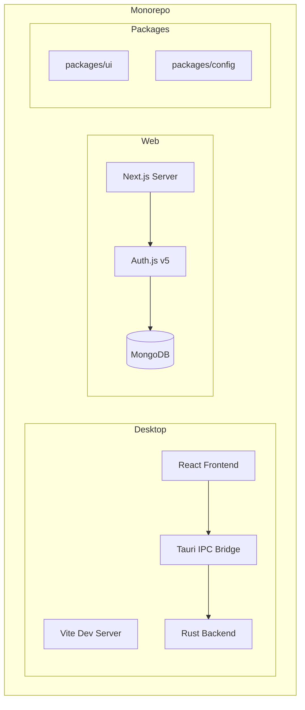
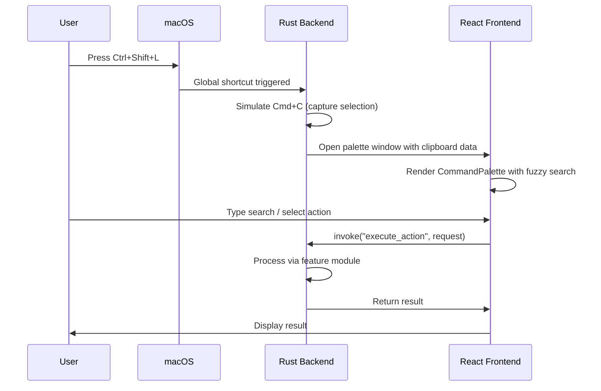
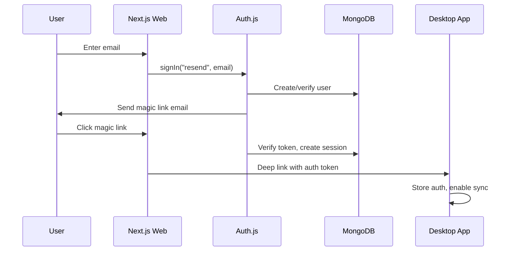

# Productivity Widgets - Complete Architecture Documentation

## Overview

**Productivity Widgets** is a macOS-only desktop productivity application built as a **TurboRepo Monorepo**. It provides quick-access utilities (translator, currency converter, unit converter, etc.) via a global hotkey-triggered Command Palette, running from the macOS menu bar.

---

## Technology Stack

| Layer              | Technology                                      |
| ------------------ | ----------------------------------------------- |
| **Monorepo**       | TurboRepo + npm workspaces                      |
| **Desktop App**    | Tauri 2.x (Rust backend + React frontend)       |
| **Web App**        | Next.js 14 (App Router)                         |
| **Frontend**       | React 19, TypeScript, Tailwind CSS, Radix UI    |
| **State**          | Zustand                                         |
| **Search**         | Fuse.js (fuzzy matching)                        |
| **Backend**        | Rust (async-std, Tauri IPC)                     |
| **Auth**           | Auth.js v5 (Magic Link via Resend)              |
| **Database**       | MongoDB + Mongoose (for web app)                |
| **System**         | macOS Private APIs (tray, global shortcuts)     |

---

## High-Level Architecture



---

## Folder Structure

```
tool-suite-antigravity/
├── apps/
│   ├── desktop/              # Tauri Desktop Application
│   └── web/                  # Next.js Web Application
├── packages/
│   ├── ui/                   # Shared UI components (placeholder)
│   └── config/               # Shared configurations (placeholder)
├── turbo.json                # TurboRepo task configuration
└── package.json              # Root workspace configuration
```

---

## Desktop Application (`apps/desktop/`)

### Structure
```
apps/desktop/
├── src/                      # React Frontend
│   ├── App.tsx               # Root component, widget router
│   ├── api.ts                # Legacy Tauri IPC wrapper
│   ├── main.tsx              # React entry point
│   ├── index.css             # Global styles
│   ├── components/           # UI Components
│   │   ├── CommandPalette.tsx      # Main command interface
│   │   ├── ui/                     # Radix UI primitives
│   │   └── widgets/                # Feature widgets
│   ├── logic/                # Business logic layer
│   │   ├── api/              # Tauri IPC calls
│   │   ├── hooks/            # React hooks
│   │   ├── state/            # Zustand store
│   │   ├── types/            # TypeScript interfaces
│   │   └── utils/            # Utility functions
│   └── types.ts              # Shared type definitions
├── src-tauri/                # Rust Backend
│   ├── src/
│   │   ├── lib.rs            # Main Tauri setup, IPC handlers
│   │   ├── main.rs           # Entry point
│   │   ├── config.rs         # Window configurations
│   │   ├── core/             # Core functionality
│   │   │   ├── clipboard/    # Clipboard monitoring
│   │   │   ├── context/      # Usage ranking
│   │   │   ├── features/     # Widget backends
│   │   │   └── security/     # Security utilities
│   │   ├── system/           # macOS integrations
│   │   │   ├── automation/   # Cmd+C simulation
│   │   │   └── window/       # NSWindow management
│   │   └── shared/           # Shared utilities
│   └── tauri.conf.json       # Tauri configuration
├── package.json              # Frontend dependencies
└── vite.config.ts            # Vite bundler config
```

### Key Files & Their Roles

#### Frontend (`src/`)

| File/Directory | Role |
|----------------|------|
| [App.tsx](file:///Users/lilitgrigorian/Desktop/tool-suite-antigravity/apps/desktop/src/App.tsx) | Root component; routes between widgets based on URL params |
| [CommandPalette.tsx](file:///Users/lilitgrigorian/Desktop/tool-suite-antigravity/apps/desktop/src/components/CommandPalette.tsx) | Main UI: fuzzy search, keyboard nav, action execution |
| `components/ui/` | Radix-based primitives: Button, Dialog, Select, Combobox, etc. |
| `components/widgets/` | 7 feature widgets (Translator, Currency, Unit, Time, Definition, Text Analyser, Settings) |
| `logic/api/tauri.ts` | Type-safe Tauri `invoke()` wrapper |
| `logic/state/store.ts` | Zustand store for global state (widget type, settings, clipboard) |
| `logic/hooks/` | Custom hooks (deep link listeners, auth) |

#### Backend (`src-tauri/src/`)

| File/Directory | Role |
|----------------|------|
| [lib.rs](file:///Users/lilitgrigorian/Desktop/tool-suite-antigravity/apps/desktop/src-tauri/src/lib.rs) | Main Tauri setup: window creation, tray menu, global shortcuts, IPC command handlers |
| `main.rs` | Entry point, calls `run()` from lib.rs |
| `config.rs` | Window dimension/position configurations |
| `core/clipboard/` | Background clipboard monitoring, history management |
| `core/features/` | Backend logic for each widget (translator, currency, unit_converter, time_converter, definition, text_analyser) |
| `core/context/` | Usage tracking for smart command ranking |
| `system/automation/` | macOS Accessibility API (simulates Cmd+C) |
| `system/window/` | NSWindow/NSPanel management for floating windows |

### Data Flow (Desktop)



---

## Web Application (`apps/web/`)

### Structure
```
apps/web/
├── app/                      # Next.js App Router
│   ├── api/                  # API routes
│   │   └── auth/[...nextauth]/   # Auth.js route handler
│   ├── dashboard/            # Protected dashboard
│   ├── login/                # Login page
│   ├── signup/               # Signup page
│   ├── onboarding/           # User onboarding flow
│   ├── layout.tsx            # Root layout
│   └── page.tsx              # Landing page
├── components/               # React components
│   └── auth/                 # Auth-related UI
├── lib/                      # Utilities
│   ├── actions/              # Server actions
│   └── db/                   # Database layer
│       ├── connect.ts        # Mongoose connection
│       ├── models.ts         # Mongoose schemas
│       ├── queries.ts        # DB query functions
│       └── adapter-client.ts # Native MongoClient for Auth.js
├── auth.ts                   # Auth.js configuration
├── auth.config.ts            # Auth providers config
└── middleware.ts             # Route protection
```

### Key Files & Their Roles

| File | Role |
|------|------|
| [auth.ts](file:///Users/lilitgrigorian/Desktop/tool-suite-antigravity/apps/web/auth.ts) | Auth.js setup with MongoDBAdapter, JWT sessions |
| `lib/db/models.ts` | Mongoose schemas (User, Device, Session, OTP) |
| `lib/db/connect.ts` | Mongoose connection singleton |
| `lib/actions/` | Server actions for auth, onboarding |
| `middleware.ts` | Route protection for authenticated pages |

### Auth Flow



---

## IPC Communication (Desktop)

The frontend communicates with the Rust backend via Tauri's `invoke()` function:

| Command | Description |
|---------|-------------|
| `get_settings` | Retrieve app settings |
| `save_settings` | Persist settings to disk |
| `capture_selection` | Simulate Cmd+C, get clipboard |
| `translate_text` | Translate via configured API |
| `convert_currency` | Currency conversion |
| `execute_action` | Run inline actions (unit, time, definition, text analysis) |
| `hide_palette_window` | Close palette on blur |
| `get_command_items` | Get available commands for palette |

---

## State Management

### Desktop (Zustand)

```typescript
// store.ts
interface AppState {
  currentWidget: WidgetType;
  settings: AppSettings | null;
  clipboardHistory: ClipboardEntry[];
  // ... actions
}
```

Widgets managed: `palette`, `translator`, `currency`, `unit_converter`, `time_converter`, `definition`, `text_analyser`, `settings`

---

## Feature Modules (Rust Backend)

Each feature is a self-contained module in `core/features/`:

| Module | File | Functionality |
|--------|------|---------------|
| **Translator** | `translator.rs` | Multi-language translation (API-based) |
| **Currency** | `currency.rs` | Live exchange rates, fuzzy currency matching |
| **Unit Converter** | `unit_converter.rs` | Comprehensive unit conversion (length, weight, volume, etc.) |
| **Time Converter** | `time_converter.rs` | Timezone conversions |
| **Definition** | `definition.rs` | Word definitions (dictionary API) |
| **Text Analyser** | `text_analyser.rs` | Word count, character analysis |

---

## UI Component Library

Based on **Radix UI** primitives, styled with **Tailwind CSS**:

| Component | File | Usage |
|-----------|------|-------|
| Button | `ui/button.tsx` | Primary actions |
| Dialog | `ui/dialog.tsx` | Modal windows |
| Select | `ui/select.tsx` | Dropdowns |
| Combobox | `ui/combobox.tsx` | Searchable selects |
| Command | `ui/command.tsx` | cmdk-based command menu |
| Popover | `ui/popover.tsx` | Floating content |
| Tabs | `ui/tabs.tsx` | Tabbed interfaces |

---

## Configuration Files

| File | Purpose |
|------|---------|
| `turbo.json` | TurboRepo task definitions (build, dev, lint) |
| `tauri.conf.json` | Tauri app config (windows, plugins, bundle) |
| `vite.config.ts` | Vite bundler configuration |
| `tailwind.config.js` | Tailwind CSS theme |
| `tsconfig.json` | TypeScript configuration |

---

## System Integration (macOS)

| Feature | Implementation |
|---------|----------------|
| **Global Shortcuts** | `tauri-plugin-global-shortcut` |
| **Tray Icon** | Native macOS menu bar integration |
| **Floating Windows** | NSWindow/NSPanel via macOS Private API |
| **Accessibility** | Simulate keyboard events for text capture |
| **Deep Links** | `prodwidgets://` custom URL scheme |

---

## Summary

The Productivity Widgets application is a sophisticated monorepo combining:

1. **Desktop App**: A Tauri-based native macOS app with a React frontend and Rust backend, providing instant-access productivity tools via global shortcuts
2. **Web App**: A Next.js companion for user management, authentication, and device sync
3. **Shared Packages**: Placeholder for future shared UI components and configurations

The architecture prioritizes:
- **Performance**: Native Rust backend for computations
- **Responsiveness**: Global shortcuts and floating windows
- **Type Safety**: Full TypeScript + Rust type definitions
- **Extensibility**: Modular feature system (easy to add new widgets)
